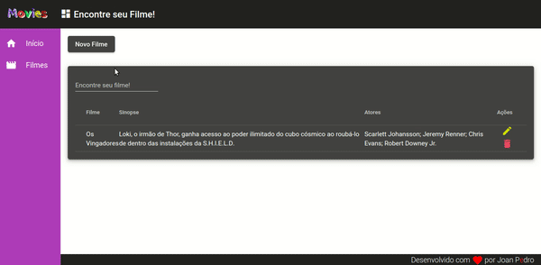
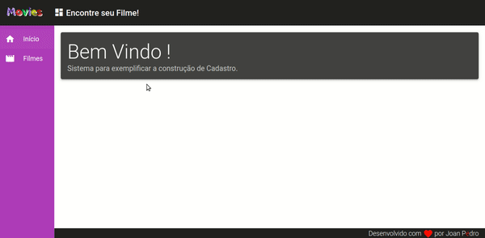

<h1 align="center">
    Catálogo de Filmes
</h1>

<h4 align="center">
  🚀 Projeto Solicitado
</h4>

  

  
  
  

  

  <a href="#-projeto">Projeto</a>&nbsp;&nbsp;&nbsp;|&nbsp;&nbsp;&nbsp;
  <a href="#-como-contribuir">Como contribuir</a>&nbsp;&nbsp;&nbsp;|&nbsp;&nbsp;&nbsp;
  <a href="#memo-licença">Licença</a>

 

## Tecnologias 

    
    

## 💻 Projeto

O teste consiste em desenvolver uma aplicação Web utilizando as tecnologias solicitadas.
A aplicação deve possibilitar que o usuário gerencie um catálogo de filmes. Deve ser possível que o usuário cadastre e consulte filmes. Além disso, deve ser possível que o usuário faça busca de filmes e visualize detalhes de cada um, como sinopse e atores.

Este projeto foi desenvolvido com as seguintes tecnologias:

- [Angular](https://angular.io/guide/updating-to-version-9)
- [Material Angular](https://material.angular.io/)
- [RxJS](https://www.learnrxjs.io/)
- [postgreSQL](https://www.postgresql.org/)
- [Docker](https://www.docker.com/)
- [Sequelize](https://sequelize.org/v5/)

## :pushpin: Recursos
- :mag_right:  Explore as operações de Criar, Remover, Atualizar e Consular;
- :money_with_wings:  Explore os Filmes individualmente através de Filtro;

## Cadastro:

## Editar:

## Remover:

## Filtrar:

## 🤔 Como contribuir

- Faça um fork desse repositório;
- Cria uma branch com a sua feature: `git checkout -b minha-feature`;
- Faça commit das suas alterações: `git commit -m 'feat: Minha nova feature'`;
- Faça push para a sua branch: `git push origin minha-feature`.

Depois que o merge da sua pull request for feito, você pode deletar a sua branch.

## :memo: Licença

Esse projeto está sob a licença MIT. Veja o arquivo [LICENSE](LICENSE) para mais detalhes.

